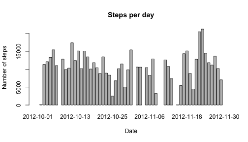
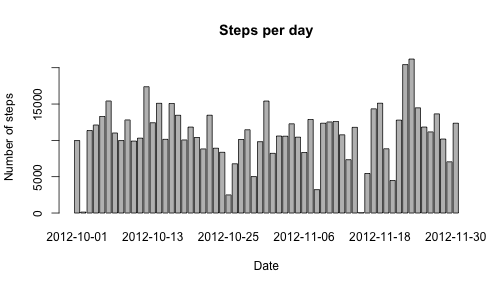

# Reproducible Research: Peer Assessment 1


## Loading and preprocessing the data


```r
data <- data.frame(read.table(unz("activity.zip", "activity.csv"), 
                              sep=",", header = TRUE, 
                              colClasses = c("numeric", "Date", "factor")))
```

## What is mean total number of steps taken per day?


```r
stepsPerDay <- aggregate(data$steps, list(date = data$date), sum)
barplot(stepsPerDay$x, names.arg = stepsPerDay$date, 
        main = "Steps per day", ylab = "Number of steps", xlab = "Date")
```

 

```r
stepsMean <- mean(stepsPerDay$x, na.rm = TRUE)
stepsMedian <- median(stepsPerDay$x, na.rm = TRUE)
```

The mean number of steps per day was 10766.19 
and the median number of steps per day was 
10765.

## What is the average daily activity pattern?


```r
library(stringr)
# extract complete cases
dataComplete <- data[complete.cases(data),]
# aggregate data
stepsPerInterval <- aggregate(dataComplete$steps, 
                              list(interval = dataComplete$interval), mean)
# sort intervals and transform them into time 
stepsPerInterval <- transform(stepsPerInterval, 
                              interval = as.numeric(as.character(interval)))
stepsPerInterval <- stepsPerInterval[order(stepsPerInterval$interval),]
stepsPerInterval <- transform(stepsPerInterval, 
                              interval = as.character(interval))
intervalTrans <- function(interval) {
    interval <- paste("000", interval, sep = "")
    interval <- substr(interval, str_length(interval)-3, str_length(interval))
    interval <- paste(substr(interval,1,2), ":", substr(interval,3,4),
                      ":00", sep="")
    interval <- strptime(interval, "%H:%M:%S")
    return(interval)
}
stepsPerInterval <- transform(stepsPerInterval, 
                              interval = intervalTrans(interval))
# plot data
plot(stepsPerInterval, type = "l", 
     main = "Mean number of steps\nper 5 Minutes interval", 
     ylab = "Number of Steps", xlab = "time")
```

 

```r
# find max
maxInt <- stepsPerInterval[stepsPerInterval$x == max(stepsPerInterval$x),1]
maxIntMin5 <- stepsPerInterval[stepsPerInterval$x == max(stepsPerInterval$x),
                               1]-300
```

The most active time was between 08:30 
*[substr(maxIntMin5,12,16)]* and 
08:35 *[substr(maxInt,12,16)]*

## Imputing missing values


```r
naNumb = sum(is.na(data[1]))
```

There data contains 2304 missing values. Analyzing the file it stands out
that thesw are not single missing values, but there are always complete days 
that are missing.  

A strategy to fill out the missing values in this case could be to fille them 
with the mean of the values measured on the same weekday and on the same 
time interval.


```r
# setting language to english - needed for weekday names. 
# This is valid only for OSX
# Other operating systems would need different values)
Sys.setlocale("LC_TIME", "en_US")
```

```
## [1] "en_US"
```

```r
data2 <- data
for(x in 1:length(data[,1])) {
    if (is.na(data2$steps[x])){
        data2$steps[x] <- mean(subset(data,
((data[,3]) == data2$interval[x])&
    (weekdays(data[,2]) == weekdays(data2$date[x])))[,1], na.rm = TRUE)
        } 
}

stepsPerDay2 <- aggregate(data2$steps, list(date = data2$date), sum)
barplot(stepsPerDay2$x, names.arg = stepsPerDay2$date, 
        main = "Steps per day", ylab = "Number of steps", xlab = "Date")
```

 

```r
stepsMean2 <- mean(stepsPerDay2$x)
stepsMedian2 <- median(stepsPerDay2$x)
```

After imputting missing values the mean is now 
10821.21 steps and the median is 
11015 steps.  
The difference compared to before is thus 
55.02 steps for the mean and 
250 steps for the median.

## Are there differences in activity patterns between weekdays and weekends?


```r
# factor for weekday vs weekend

dayarray = weekdays(data2$date)

weekday <- function(x) {
    if (x=="Sunday"|x=="Saturday") {
        return("weekend")
    } else {
        return("weekday")
    }
}

dayarray <- factor(sapply(dayarray, weekday))
data2 <- cbind(data2, dayarray)

# aggregate data
stepsPerInterval2 <- aggregate(data2$steps, 
            list(interval = data2$interval, kindOfDay = data2$dayarray), mean)
# sort intervals and transform them into time 
stepsPerInterval2 <- transform(stepsPerInterval2, 
                              interval = as.numeric(as.character(interval)))
stepsPerInterval2 <- stepsPerInterval2[order(stepsPerInterval2$interval),]
stepsPerInterval2 <- transform(stepsPerInterval2, 
                              interval = as.character(interval))
intervalTrans <- function(interval) {
    interval <- paste("000", interval, sep = "")
    interval <- substr(interval, str_length(interval)-3, str_length(interval))
    interval <- paste(substr(interval,1,2), ":", substr(interval,3,4),
                      ":00", sep="")
    interval <- strptime(interval, "%H:%M:%S")
    return(interval)
}
stepsPerInterval2 <- transform(stepsPerInterval2, 
                              interval = intervalTrans(interval))
# plot data
par(mfrow = c(2, 1))
temp = par("mar")
par(mar = c(4.1, 4.1, 2.1, 2.1))
plot(subset(stepsPerInterval2, kindOfDay == "weekend")$interval,
     subset(stepsPerInterval2, kindOfDay == "weekend")$x, type = "l", 
     main = "weekend", 
     ylab = "Number of Steps", xlab = "", ylim = c(0,250))
plot(subset(stepsPerInterval2, kindOfDay == "weekday")$interval,
     subset(stepsPerInterval2, kindOfDay == "weekday")$x, type = "l", 
     main = "weekday", 
     ylab = "Number of Steps", xlab = "time", ylim = c(0,250))
```

 

```r
par(mfrow = c(1, 1))
par(mar=temp)
```

Definitively, there's a difference!
